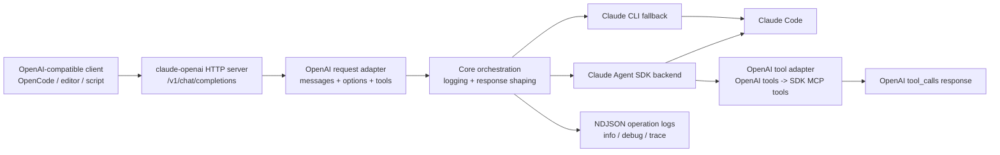

# claude-openai

[](https://github.com/daongoc315/claude-openai/actions/workflows/ci.yml)
[](https://www.npmjs.com/package/claude-openai)
[](./LICENSE)

Local OpenAI-compatible HTTP/SSE server for Claude Code.

`claude-openai` lets OpenAI Chat Completions clients talk to Claude Code through a small local server. It is built for local developer workflows such as OpenCode, editor agents, scripts, and tools that expect `/v1/chat/completions`.

> Alpha software. Keep it local unless you add your own hardening, auth, and network controls.

## Features

- OpenAI-style endpoints:
  - `GET /health`
  - `GET /v1/models`
  - `POST /v1/chat/completions`
- Non-streaming and streaming SSE responses.
- Default backend: `@anthropic-ai/claude-agent-sdk`.
- CLI fallback backend for older/local workflows.
- OpenAI `tools` support through a Claude Agent SDK adapter.
- Flat CLI flags for normal setup; `CLAUDE_OPENAI_*` env vars for automation.
- Structured NDJSON operation logs enabled by default at `debug` level so you can see HTTP summaries plus request/response payloads during local operation.

## Architecture



The design keeps each boundary explicit:

1. The HTTP layer speaks OpenAI-compatible JSON/SSE.
2. The adapter converts OpenAI requests into Claude execution args.
3. The SDK client runs Claude Code and returns text, usage, and tool calls.
4. The tool adapter is schema-driven: OpenAI tool schemas become Claude SDK MCP tools, and SDK `tool_use` events are converted back to OpenAI `tool_calls`.
5. Logging is operational by default: HTTP visibility first, deeper payload/protocol logs by level.

Tool validation is not handled with string scraping. Tool arguments are validated against the request's JSON schema shape before an SDK `tool_use` is returned as an OpenAI `tool_calls` response.

## Requirements

- Node.js `>=20`
- Claude Code installed and authenticated:

```bash
npm install -g @anthropic-ai/claude-code
claude --version
```

For development, install [Bun](https://bun.sh/).

## Install

```bash
npm install -g claude-openai
```

Or run without installing:

```bash
npx -y claude-openai --port 8000
```

## Quick start

Start the local server:

```bash
claude-openai --port 8000 --api-key dev-local-key
```

Call it like OpenAI:

```bash
curl http://127.0.0.1:8000/v1/chat/completions \
  -H 'content-type: application/json' \
  -H 'authorization: Bearer dev-local-key' \
  -d '{
    "model": "claude-sonnet",
    "messages": [{ "role": "user", "content": "Say hello in one sentence." }]
  }'
```

Streaming:

```bash
curl -N http://127.0.0.1:8000/v1/chat/completions \
  -H 'content-type: application/json' \
  -H 'authorization: Bearer dev-local-key' \
  -d '{
    "model": "claude-sonnet",
    "stream": true,
    "messages": [{ "role": "user", "content": "Count to three." }]
  }'
```

## CLI usage

```bash
claude-openai [options]
claude-openai --background [options]
claude-openai status
claude-openai stop
claude-openai runs
claude-openai tail <runId>
claude-openai cancel <runId>
```

Common flat flags:

```bash
claude-openai \
  --host 127.0.0.1 \
  --port 8000 \
  --api-key dev-local-key \
  --backend sdk \
  --default-model sonnet
```

Debug/log flags:

```bash
claude-openai \
  --debug \
  --log true \
  --log-level debug \
  --log-file claude-openai.log.ndjson
```

`--trace` is kept as a protocol-debug alias:

```bash
claude-openai \
  --trace true \
  --trace-file claude-openai.trace.ndjson
```

Advanced flat flags:

```bash
claude-openai \
  --claude-command claude \
  --allowed-working-directory-prefixes /Users/me/project,/tmp \
  --allowed-permission-modes acceptEdits,auto,default,plan \
  --max-concurrency 4 \
  --max-queue-size 100 \
  --process-timeout-ms 300000 \
  --max-request-bytes 10485760
```

Every CLI flag is translated to process config before the server starts, so you usually do not need to export env vars manually.

## Docker

The repository includes a `Dockerfile` and `docker-compose.yml` for running the OpenAI-compatible server in a local container.

Build and run with Docker Compose:

```bash
CLAUDE_OPENAI_API_KEY=dev-local-key \
CLAUDE_WORKSPACE=/path/to/your/project \
docker compose up --build
```

The compose file binds the service to loopback only:

```text
http://127.0.0.1:8000/v1
```

Use it from OpenAI-compatible clients with:

```text
Base URL: http://127.0.0.1:8000/v1
API key:  dev-local-key
Model:    claude-sonnet
```

Mounted paths:

- `${CLAUDE_WORKSPACE:-.}` → `/workspace`, used as the allowed working-directory prefix.
- `${HOME}/.claude` → `/home/node/.claude`, for Claude Code auth/config.
- `${HOME}/.config/claude` → `/home/node/.config/claude`, for alternate Claude config storage.

Example request:

```bash
curl http://127.0.0.1:8000/v1/chat/completions \
  -H 'content-type: application/json' \
  -H 'authorization: Bearer dev-local-key' \
  -d '{
    "model": "claude-sonnet",
    "messages": [{ "role": "user", "content": "Say hello from Docker." }],
    "claude": { "workingDirectory": "/workspace" }
  }'
```

Notes:

- Keep the container bound to `127.0.0.1` unless you add proper network/auth hardening.
- If your Claude Code login is stored in the OS keychain instead of files, the mounted config directories may not be enough; log in inside the container or use an API/cloud auth path.
- The image installs `@anthropic-ai/claude-code` globally and runs the built server with Node.

## Environment variables

Env vars are useful for Docker, systemd, launch agents, or hosted local daemons.

| Variable | Default | Description |
| --- | --- | --- |
| `CLAUDE_OPENAI_HOST` | `127.0.0.1` | Bind host |
| `CLAUDE_OPENAI_PORT` / `PORT` | `8000` | HTTP port |
| `CLAUDE_OPENAI_API_KEY` / `API_KEY` | unset | Optional bearer token |
| `CLAUDE_OPENAI_BACKEND` | `sdk` | `sdk` or `cli` |
| `CLAUDE_OPENAI_CLAUDE_COMMAND` / `CLAUDE_COMMAND` | `claude` | Claude CLI command/path |
| `CLAUDE_OPENAI_DEFAULT_MODEL` / `CLAUDE_DEFAULT_MODEL` | `sonnet` | Default Claude model alias |
| `CLAUDE_MODELS_OVERRIDE` | built-in aliases | Comma-separated model list for `/v1/models` |
| `CLAUDE_OPENAI_ALLOWED_PERMISSION_MODES` | `acceptEdits,auto,default,plan` | Accepted SDK permission modes |
| `CLAUDE_OPENAI_ALLOWED_WORKING_DIR_PREFIXES` | current dir | Allowed workspace prefixes |
| `CLAUDE_OPENAI_MAX_CONCURRENCY` | `2` | Concurrent Claude executions |
| `CLAUDE_OPENAI_MAX_QUEUE_SIZE` | `100` | Queue size limit |
| `CLAUDE_OPENAI_PROCESS_TIMEOUT_MS` | `120000` | CLI fallback process timeout |
| `CLAUDE_OPENAI_OUTPUT_DIR` | `~/.claude-openai/output` | Captured CLI fallback output |
| `CLAUDE_OPENAI_LOG` | `true` | Set `false` to disable structured operation logs. Also accepts `0`, `no`, `off` |
| `CLAUDE_OPENAI_LOG_LEVEL` | `debug` | `info`, `debug`, or `trace` |
| `CLAUDE_OPENAI_LOG_FILE` | stdout | Optional log output path, e.g. `claude-openai.log.ndjson` |
| `CLAUDE_OPENAI_TRACE` | unset | Protocol-debug alias; use `true` for trace-style logs |
| `CLAUDE_OPENAI_TRACE_FILE` | unset | Legacy trace output path; overridden by `CLAUDE_OPENAI_LOG_FILE` |
| `CLAUDE_OPENAI_DEBUG` / `DEBUG` | unset | Extra stderr diagnostics |

## OpenAI client configuration

Point any OpenAI-compatible client at the local base URL:

```text
Base URL: http://127.0.0.1:8000/v1
API key:  dev-local-key
Model:    claude-sonnet
```

Example JavaScript client:

```ts
import OpenAI from "openai";

const client = new OpenAI({
  baseURL: "http://127.0.0.1:8000/v1",
  apiKey: "dev-local-key",
});

const result = await client.chat.completions.create({
  model: "claude-sonnet",
  messages: [{ role: "user", content: "Summarize this project." }],
});

console.log(result.choices[0]?.message?.content);
```

## Tool calling

`claude-openai` accepts OpenAI-style `tools` on chat completion requests. In SDK mode, tools are adapted into Claude Agent SDK MCP tools, then captured back as OpenAI `tool_calls`.

Example:

```json
{
  "model": "claude-sonnet",
  "messages": [{ "role": "user", "content": "Look up order 123." }],
  "tools": [
    {
      "type": "function",
      "function": {
        "name": "lookup_order",
        "description": "Look up an order by id",
        "parameters": {
          "type": "object",
          "properties": {
            "id": { "type": "string" }
          },
          "required": ["id"]
        }
      }
    }
  ]
}
```

Notes:

- Final tool-call validation is driven by the JSON schema shape from the request, including supported types, enums, arrays, objects, and nested `required` fields.
- The adapter keeps the MCP capture schema permissive so partial SDK tool inputs can be observed, then validates strictly before returning OpenAI `tool_calls`.
- Tool names must use OpenAI-compatible function naming: letters, numbers, `_`, or `-`, up to 64 characters.
- Treat tool support as experimental until you have tested your specific client/tool flow.

## Backends

### SDK backend, default

```bash
claude-openai --backend sdk
```

Uses `@anthropic-ai/claude-agent-sdk`. This is the recommended backend and the only backend with OpenAI tool adapter support.

### CLI fallback backend

```bash
claude-openai --backend cli
```

Uses a supervised `claude` CLI process. This is retained for compatibility and diagnostics.

## Background mode

```bash
claude-openai --background --port 8000 --api-key dev-local-key
claude-openai status
claude-openai stop
```

Daemon metadata uses temp files named:

```text
claude-openai.pid
claude-openai.port
```

Run outputs are stored under:

```text
~/.claude-openai/output
```

## Logging and debugging

Structured operation logging is enabled by default. The default level is `debug`, which logs HTTP summaries plus request/response payloads, adapter args, and tool-call metadata. This is intentionally useful for local operation and debugging client/server mismatches.

For background mode or long-running local use, write logs to a file:

```bash
claude-openai --log-file ./claude-openai.log.ndjson
```

Use `info` when you only want HTTP middleware summaries such as request method, path, status, duration, and request id:

```bash
claude-openai --log-level info --log-file ./claude-openai.log.ndjson
```

Use `debug` explicitly when you want the default request/response visibility:

```bash
claude-openai --log true --log-level debug --log-file ./claude-openai.log.ndjson
```

Use `trace` for raw/deep SDK protocol events:

```bash
claude-openai --log true --log-level trace --log-file ./claude-openai.trace.ndjson
```

The log includes events such as:

- `server.start`
- `http.request` (`info`)
- `openai.request`
- `openai.effective_request`
- `adapter.claude_args`
- `sdk.message`
- `sdk.structured_tool_call`
- `sdk.can_use_tool`
- `openai.response`
- `openai.stream_tool_calls`
- `sdk.error`

Logs are NDJSON and redact secret-like keys such as authorization headers, API keys, tokens, cookies, and passwords.

## Security notes

- Bind to `127.0.0.1` unless you intentionally expose the server.
- Set `--api-key` when other local users or network clients may reach the port.
- Do not expose this server directly to the public internet.
- Claude Code runs with the OS permissions of this process.
- Tool-capable requests can lead to filesystem and command execution depending on Claude Code permissions and configuration.

## Development

```bash
bun install
bun run typecheck
bun test
bun run ci
```

Build:

```bash
bun run build
```

Dry-run package:

```bash
npm pack --dry-run
```

## License

MIT
